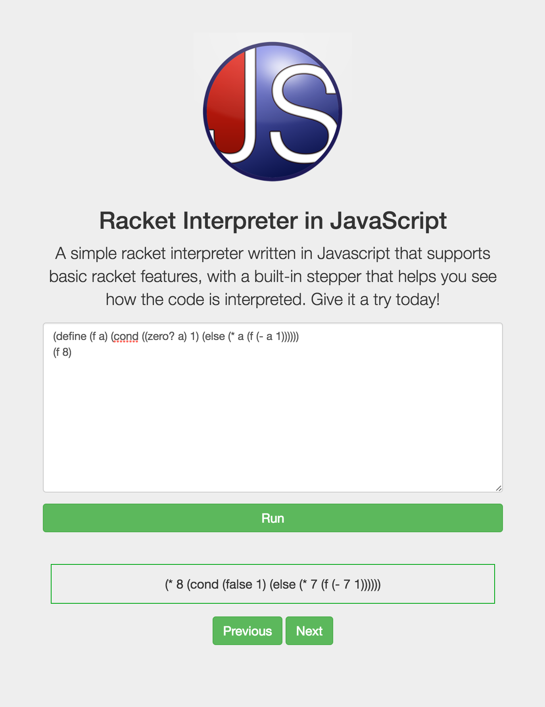

# Racket.js
Hack Princeton Fall 2016 Project created by  

Live at https://racketjs.com

Don't you hate it when we're given stepper questions on the CS exam? Don't you get frustrated when you have to step through all that messy recursion in the ugly UI of Dr Racket? Well Racket.js has come to save all first year university students whose CS course is taught in Racket. We have always wanted to create a cleaner and prettier UI of Racket's stepper, which eliminates all the useless code and only steps the code we want for us. Thus we decided to do this hack in Hack Princeton.

## What is Racket.js
Racket.js is essentially a Racket interpreter which parses blocks of code that the user passes in; then it goes through the code to generate and display the following steps one by one, showing the user how the code is actually processed.

## How we built it
Our project is primarily built with JavaScript, which controls the entire logic of the system. In JavaScript, briefly, we parse through each character of the code that the user passes in and at the same time, we have to set functions or conditions needed to distinguish between operators, identifiers or arguments of the code. After the code is parsed, we have to store the actual processes and steps that the code will take, which are calculated with functions we defined in JavaScript. JQuery and BootStrap are used to bring out and animate these steps on the front end for enhanced user experience.

## Challenges we ran into
This is probably the most difficult project that my teammate and I have ever done. The biggest challenge is definitely processing the code that the user has entered and designing the whole scheme of how this code should be stepped. If the user inputs simple definitions, it's not that difficult. However when we have to consider recursive functions and cases, we got very confused. We spent approximately 6 hours on debugging (cond) statement in recursive definitions. However in the end we both figured it out and were able to implement recursive definitions as a test case.

## Accomplishments that we're proud of
Racket.js itself is an accomplishment we are proud of because first of all, neither of us have ever built an interpreter, or any projects of the same level of difficulty; moreover before we came to the Hackathon, we almost had no clue how to even begin, so finishing the project is already an achievement. Further, I have very little experience in coding, and I have only briefly acquainted with JavaScript. I'm very happy to say that throughout this process, I got a lot more comfortable with this language and I learned a lot of new skills not only in just coding but also in how to approach problems.

## What's next for Racket.js
Racket.js right now only supports "Beginning Students with List Abbreviations", thus it does not have all of the built-in functions defined in order to be processed. We are thinking about expanding it to full racket, and making the animations even better with visuals, instead of just texts of steps.
